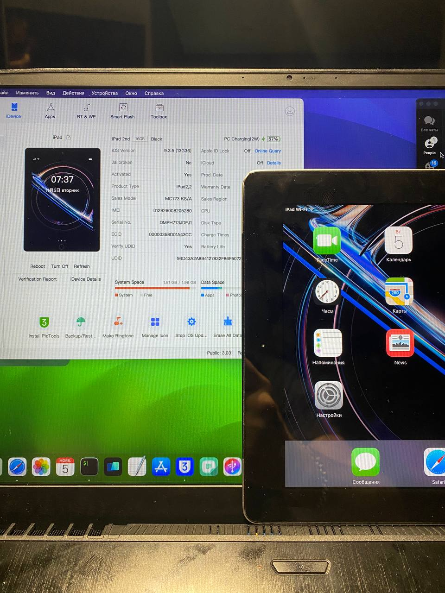

# Модификация системных строк iPad 2,2 (A1396)
### Технический отчет об изменении системного уведомления

 <!-- *(Добавьте логотип проекта, если есть)* -->

[](https://github.com/SmartMaster35Rus)


## 📋 Общая информация

**Дата выполнения:** 07:45 AM 05.11.2024  
**Исполнитель:** SmartMaster35Rus / Dev  
**Устройство:** iPad 2,2 (модель A1396)

## 🎯 Задача
Изменение системного уведомления об отсутствии SIM-карты на устройстве:
- Исходное значение: `"No_SIM | Нет Sim-карты"`
- Целевое значение: `"No_SIM | iPad Wi-Fi"`

## 🛠 Использованные инструменты
- Режим Ramdisk
- PropertyTree (редактор)
- Доступ к системным файлам

## 📝 Процесс выполнения

### 1. Подготовительный этап
- ✅ Успешная загрузка устройства в режим Ramdisk
- ✅ Получение доступа к системным файлам

### 2. Локализация и модификация
```bash
Путь: mnt1/system/library/coreservice/StringBoard.app/ru.lproj/StringBoard.Strings
```

### 3. Внесение изменений
```diff
- "No_SIM | Нет Sim-карты"
+ "No_SIM | iPad Wi-Fi"
```

## ✅ Результат
- Успешное отображение нового значения в header
- Корректное применение изменений
- Стабильная работа системы

## 📌 Дополнительные замечания
- Изменения носят косметический характер
- Не влияют на функциональность устройства
- Сохраняются после перезагрузки

## 💡 Рекомендации
1. Создать резервную копию оригинального файла
2. Возможно восстановление исходных значений
3. Метод применим к другим моделям iPad с соответствующей файловой структурой

## ⚠️ Важно
Все модификации системных файлов выполняются на свой страх и риск. Рекомендуется создавать резервные копии перед внесением изменений.

## 📜 Лицензия
MIT License

## 📞 Контакты
- Developer: SmartMaster35Rus
- Role: Dev

---
*Документация создана: 05.11.2024*
```
